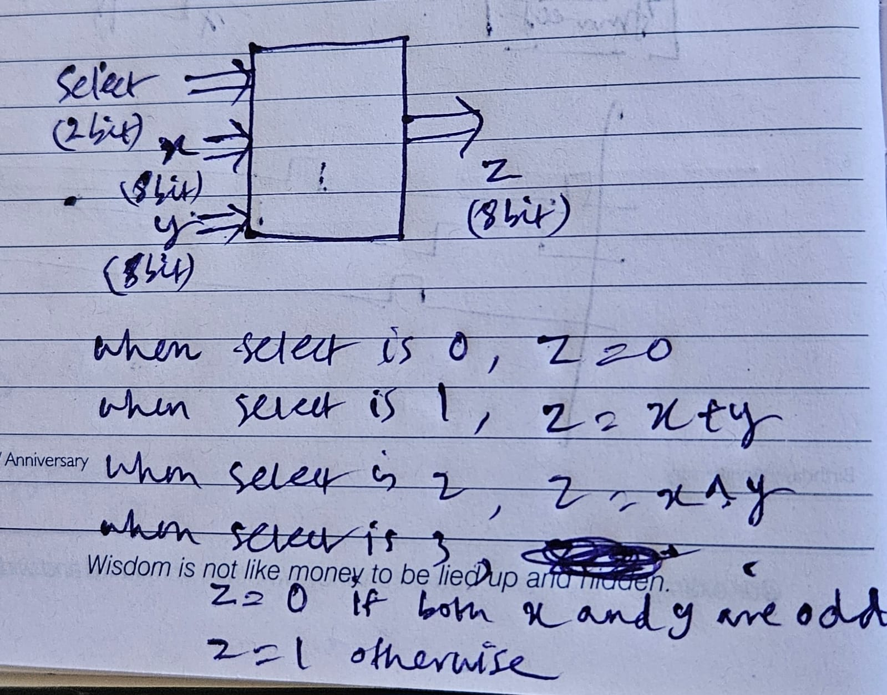
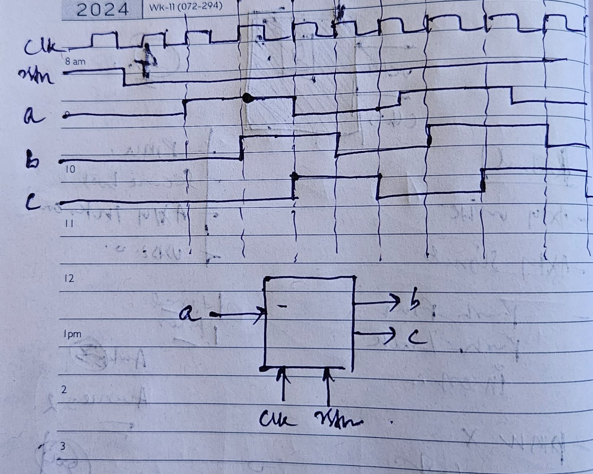
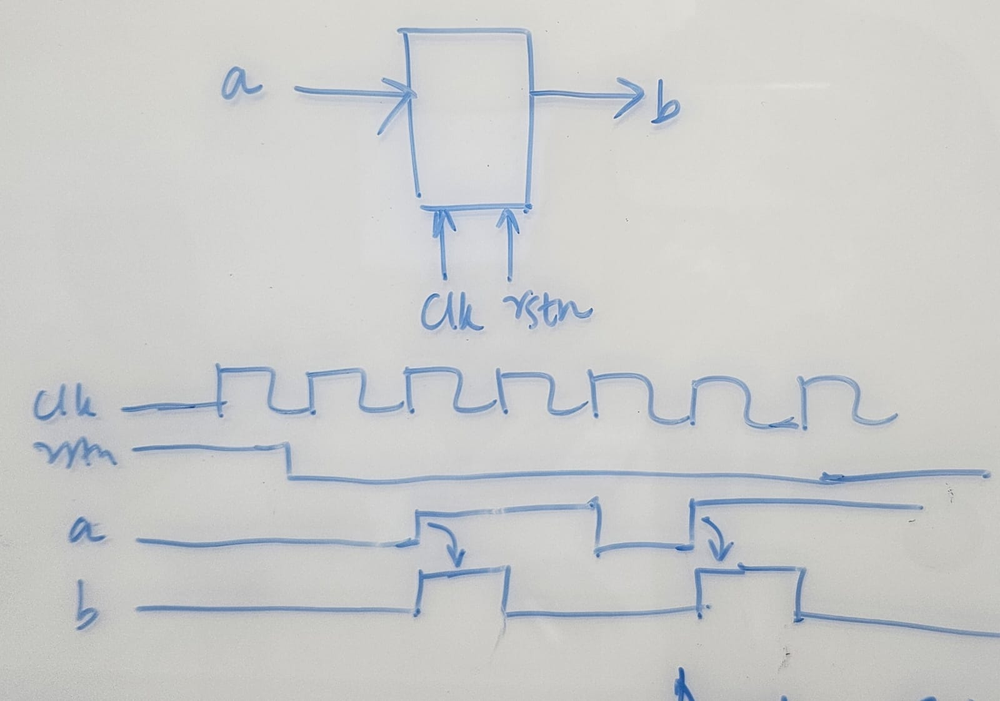
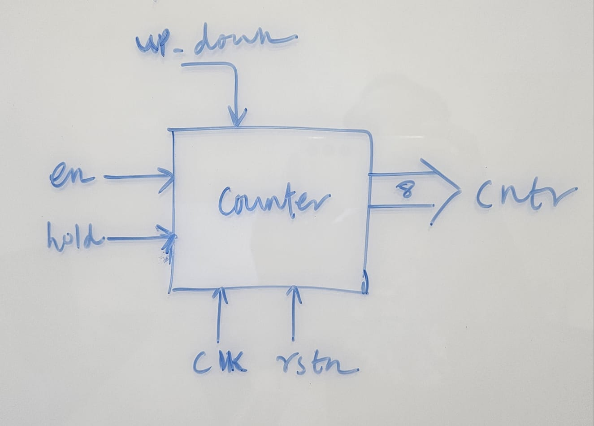

# DVLSI  

## Verilog Assignment  

### Q1   
  

- select is a 2-bit input.
- x and y are 8-bit inputs.
- z is an 8-bit output.
- Use case statement inside always block to handle multiple select conditions:
    
    00: z = 0

    01: z = x + y

    10: z = x ^ y

    11: z = 0 if both x and y are odd (i.e LSB of x and y are 1), otherwise z = 1

### Q2

- b and c are delayed versions of a (b is delayed by one cycle and c is delayed by 2 cycles w.r.t a)
- crcuit works on +ve edge of the clock and -ve edge reset
- reset=0 means circuit gets reset(i.e active low reset)
- here reset is an asynchronous active low (i.e independent of clk)

### Q3

- +ve edge detector
- reset is async, active low
- The input signal A is synchronous to the clock. Whenever A goes high, the output signal B should go high for 1 clock cycle. When reset is asserted, output B remains at 0.

### Q4

- Reset is async active low i.e the counter remains at 0  while under reset, When out of reset, it counts only if en signal is high, else it remains at 0.
- The counter upcounts if the signal up_down is high, else it downcounts. If the hold signal is high, the counter pauses at whatever count it is. It continues counting when hold is low.